# ANSIBLE REFACTORING AND STATIC ASSIGNMENTS (IMPORTS AND ROLES)

In this project, I will be enhancing the architecture from project 11 by refactoring the ansible codes and adding import functionality.

## Step 1 – Jenkins job enhancement

The previous design consumes space on Jenkins servers with each subsequent change. Let us enhance it by introducing a new Jenkins project/job – which will require ***Copy Artifact plugin*** as in the steps below:

1. On Jenkins-Ansible server ceate a new directory called `ansible-config-artifact` – we will store there all artifacts after each build.

`sudo mkdir /home/ubuntu/ansible-config-artifact`

2. Change permissions to this directory, so Jenkins could save files there – 
`chmod -R 0777 /home/ubuntu/ansible-config-artifact`

3. In Jenkins web console ***-> Manage Jenkins -> Manage Plugins -> on Available tab search for Copy Artifact and install this plugin without restarting Jenkins***

4. Create a new Freestyle projec, name it `save_artifacts` and set it to discard builds and with the following configs as below:


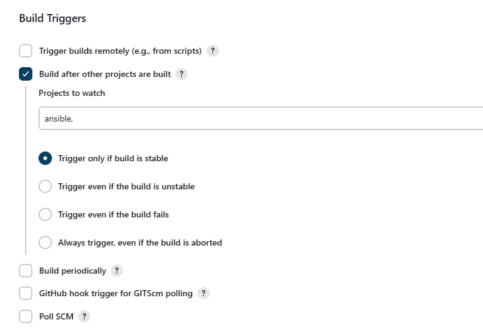


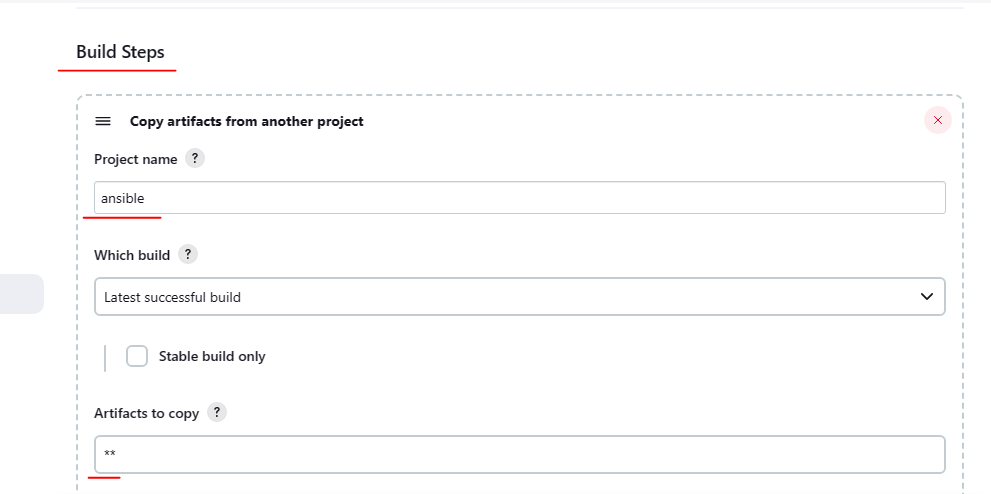


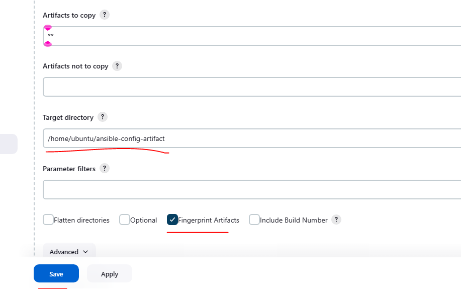


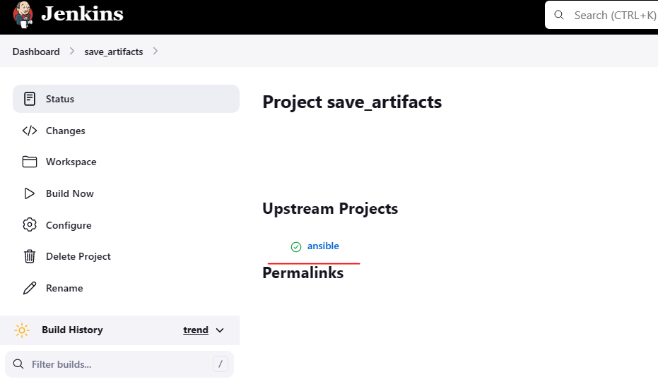


save-artifact-error.PNG


artifact-error.PNG


updated-in-var-directory.PNG

This failed for me a couple of tries and after a lot of tweeks with the `/home/ubuntu/ansible-config-artifact` directory


So I created the `ansible-config-artifact` directory in the `/var/lib/jenkins` directory and updated both ownership and permission. Also updated the directory in the save_artifats job in jenkins:


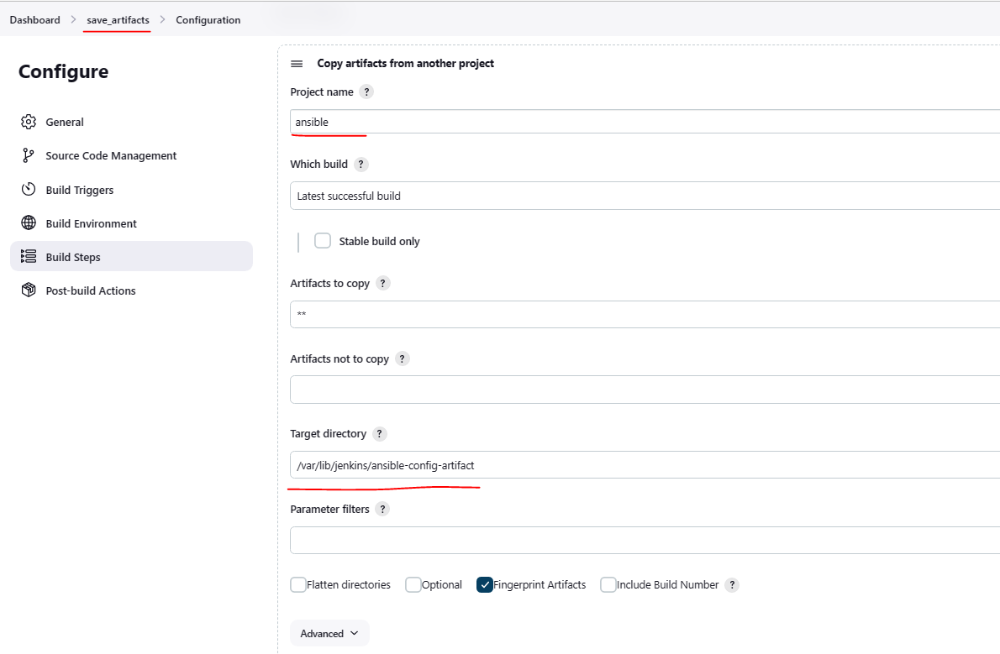


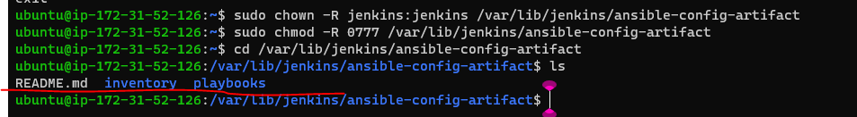


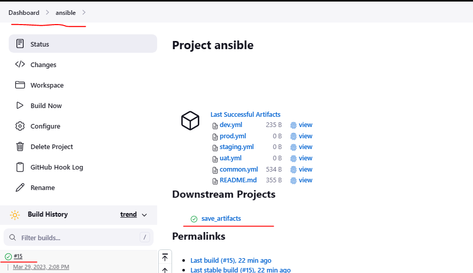


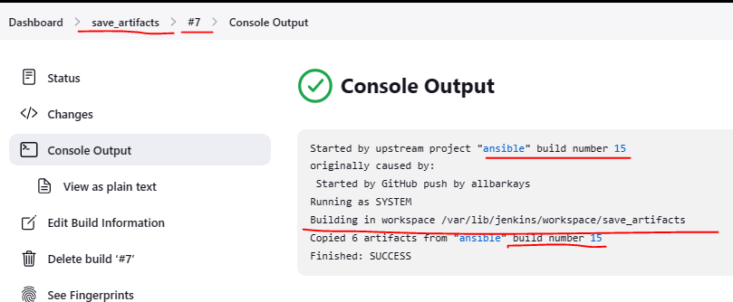


## Step 2 – Refactor Ansible code by importing other playbooks into site.yml

In ***Project 11*** I wrote all tasks in a single playbook `common.yml`, pretty simple because the set of instructions were for only 2 types of OS, but imagine I have many more tasks and need to apply the playbook to other servers with different requirements. In this case, I will have to read through the whole playbook to check if all tasks written there are applicable and is there anything that needs to be added for certain server/OS families. Very fast it will become a tedious exercise and my playbook will become messy with many commented parts. DevOps colleagues will not appreciate such organization of the codes and it will be difficult for them to use my playbook.

1. create a new branch "refactor" and switch to the branch using : 
`git checkout -b refactor`

2. Within playbooks folder, create a new file and name it `site.yml`. This file will now be the parent to all other playbooks


`touch playbooks/site.yml`

3. Create a new folder in root of the repository and name it `static-assignments`. The static-assignments folder is where all other children playbooks will be stored. 

4. Move `common.yml` file into the newly created static-assignments folder.

5. Inside `site.yml` file, import `common.yml` playbook. This code uses built in `import_playbook` Ansible module.

```
---
- hosts: all
- import_playbook: ../static-assignments/common.yml
```

6. Run `ansible-playbook` command against the dev environment


Since I would need to apply some tasks to the ***dev servers*** and ***wireshark*** is already installed – I would go ahead and create another playbook under ***static-assignments*** and name it `common-del.yml`pasting the code below. This is to configure deletion of wireshark utility.

```
---
- name: update nfs and web servers
  hosts: nfs, webservers
  remote_user: ec2-user
  become: yes
  become_user: root
  tasks:
  - name: delete wireshark
    yum:
      name: wireshark
      state: removed

- name: update LB and DB server
  hosts: lb, db
  remote_user: ubuntu
  become: yes
  become_user: root
  tasks:
  - name: delete wireshark
    apt:
      name: wireshark-qt
      state: absent
      autoremove: yes
      purge: yes
      autoclean: yes
```

Now update `site.yml` with `- import_playbook: ../static-assignments/common-del.yml` instead of `common.yml` and run it against ***dev*** servers:

```
cd /home/ubuntu/ansible-config-mgt/

ansible-playbook -i inventory/dev.yml playbooks/site.yaml
```

Now, I would commit my code update to my GitHub branch ***(refactor)*** and then create pull request, compare, and merge pull request to the ***main branch***

`git status`

`git add .`

`git commit -m "commit message"`

`git push origin refactor`


* On merging the code to the main branch, my Jenkins job updated a build.


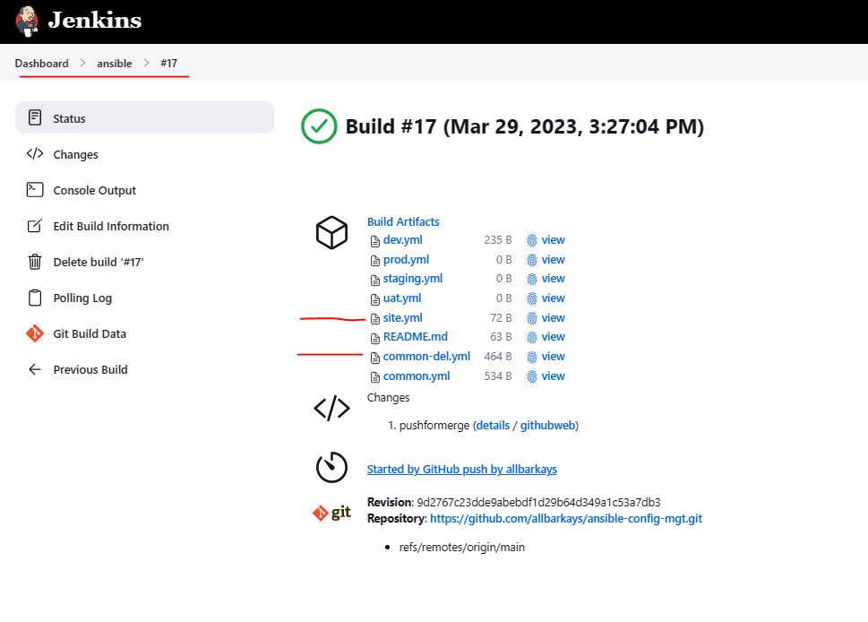


Now, run the playbook:
```
ansible-playbook -i /var/lib/jenkins/jobs/ansible/builds/<builds-number>/archive/inventory/dev.yml /var/lib/jenkins/jobs/ansible/builds/<builds-number>/archive/playbooks/site.yml
```

In my case:
```
ansible-playbook -i /var/lib/jenkins/jobs/ansible/builds/17/archive/inventory/dev.yml /var/lib/jenkins/jobs/ansible/builds/17/archive/playbooks/site.yml
```


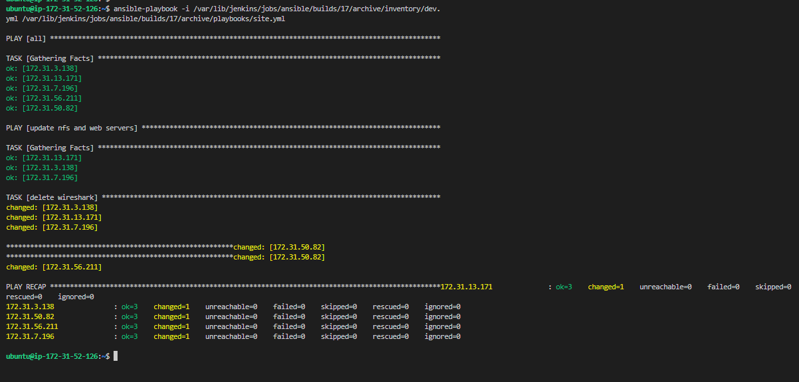


Then, check to ensure that ***wireshark*** is deleted on all the servers by running `wireshark --version`

**Before:**


**After:**

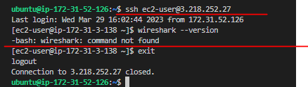


Now I have put the `import_playbooks` module to use and I have a ready solution to install/delete packages on multiple servers with just one command.


## Step 3 – Configure UAT Webservers with a role ‘Webserver’

Now I have a nice and clean `dev` environment, so I would put that aside and configure ***2 new Web Servers*** as `uat`. I could write tasks to configure Web Servers in the same playbook, but it would be too messy, instead, I will use a dedicated `role` to make our configuration reusable.

1. Launch 2 fresh EC2 instances using RHEL 8 image to be used as `uat servers` naming them accordingly as ***`Web1-UAT`*** and ***`Web2-UAT`***.


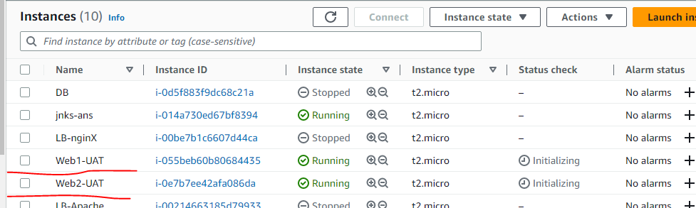


2. To create a `role`, I must create a directory called `roles/`, relative to the playbook file or in /etc/ansible/ directory.

There are ***two*** ways to create this folder structure:

* Use an Ansible utility called `ansible-galaxy` inside `ansible-config-mgt/roles` directory (where I would need to create roles directory upfront)
```
mkdir roles
cd roles
ansible-galaxy init webserver
```

* Create the `directory/files` structure manually

I will go with the second option since I have hosted my codes in ***`GitHub`*** rather than locally on ***`Jenkins-Ansible server.`***

Below is what the resulting `roles` structure should look like:

```
└── webserver
    ├── README.md
    ├── defaults
    │   └── main.yml
    ├── handlers
    │   └── main.yml
    ├── meta
    │   └── main.yml
    ├── tasks
    │   └── main.yml
    └── templates
```

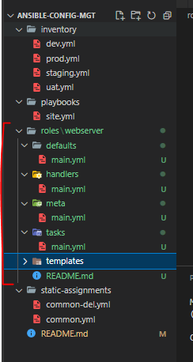


3. Update the inventory `ansible-config-mgt/inventory/uat.yml` file with IP addresses of the 2 UAT Web servers

```
[uat-webservers]
<Web1-UAT-Server-Private-IP-Address> ansible_ssh_user='ec2-user' 

<Web2-UAT-Server-Private-IP-Address> ansible_ssh_user='ec2-user' 
```

4. In `/etc/ansible/ansible.cfg` file uncomment `roles_path` string and provide a full path to the roles directory `roles_path    = /home/ubuntu/ansible-config-mgt/roles`, so **Ansible** could know where to find configured `roles`.

`sudo vi /etc/ansible/ansible.cfg`

I did not find this folder existing so I created manually and added my `role_path`:


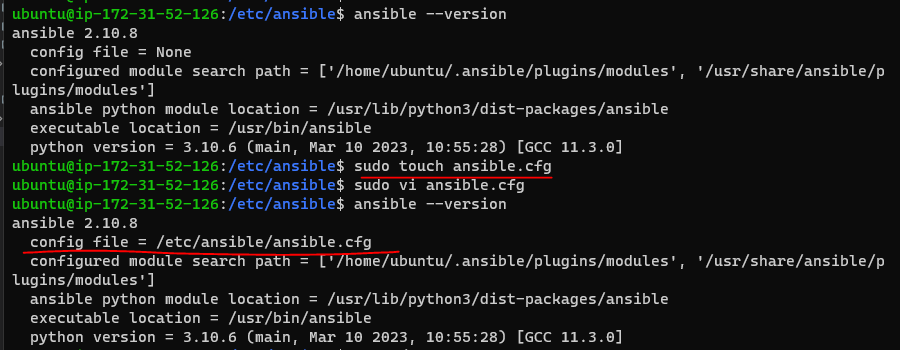


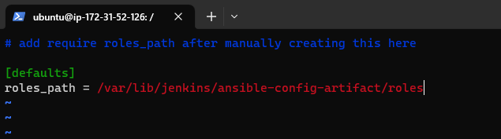

5. It is time to start adding some logic to the webserver role. In the `tasks` directory, and within the `main.yml` file, write configuration tasks to do the following:

* Install and configure Apache (httpd service)

* Clone Tooling website from GitHub https://github.com/<your-name>/tooling.git.

* Ensure the tooling website code is deployed to /var/www/html on each of 2 UAT Web servers.

* Make sure httpd service is started

```
---
- name: install apache
  become: true
  ansible.builtin.yum:
    name: "httpd"
    state: present

- name: install git
  become: true
  ansible.builtin.yum:
    name: "git"
    state: present

- name: clone a repo
  become: true
  ansible.builtin.git:
    repo: https://github.com/<your-name>/tooling.git
    dest: /var/www/html
    force: yes

- name: copy html content to one level up
  become: true
  command: cp -r /var/www/html/html/ /var/www/

- name: Start service httpd, if not started
  become: true
  ansible.builtin.service:
    name: httpd
    state: started

- name: recursively remove /var/www/html/html/ directory
  become: true
  ansible.builtin.file:
    path: /var/www/html/html
    state: absent
```


## Step 4 – Reference ‘Webserver’ role

Within the `static-assignments` folder, create a new assignment for ***uat-webservers*** `uat-webservers.yml`. This is where the role will be referenced.

```
---
- hosts: uat-webservers
  roles:
     - webserver
```

Since the entry point to our ansible configuration is the `site.yml` file. I would need to refer the `uat-webservers.yml` role inside `site.yml`.

So, we should have this below in `site.yml`

```
---
- hosts: all
- import_playbook: ../static-assignments/common.yml

- hosts: uat-webservers
- import_playbook: ../static-assignments/uat-webservers.yml
```

## Step 5 – Commit & Test
Commit the changes, create a Pull Request and merge them to `master` branch, making sure webhook triggered two consequent Jenkins jobs, they ran successfully and copied all the files to the Jenkins-Ansible server into /home/ubuntu/ansible-config-mgt/ directory.

Now run the playbook against my `uat` inventory and see what happens:

`sudo ansible-playbook -i /home/ubuntu/ansible-config-mgt/inventory/uat.yml /home/ubuntu/ansible-config-mgt/playbooks/site.yaml`


In my case:

```
sudo ansible-playbook -i /var/lib/jenkins/ansible-config-artifact/inventory/uat.yml /var/lib/jenkins/ansible-config-artifact/playbooks/site.yml
```


Ansible architecture now looks like this:

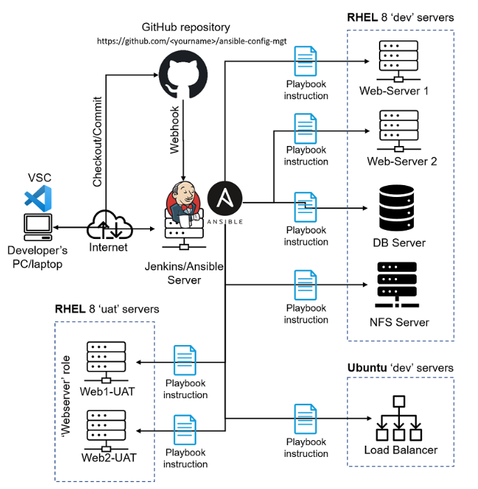


